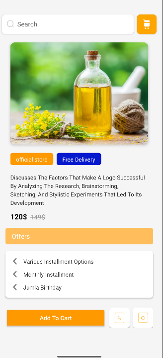
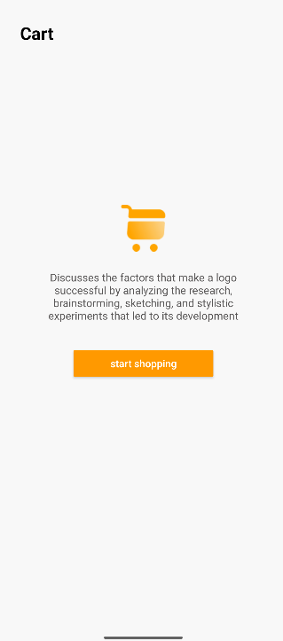
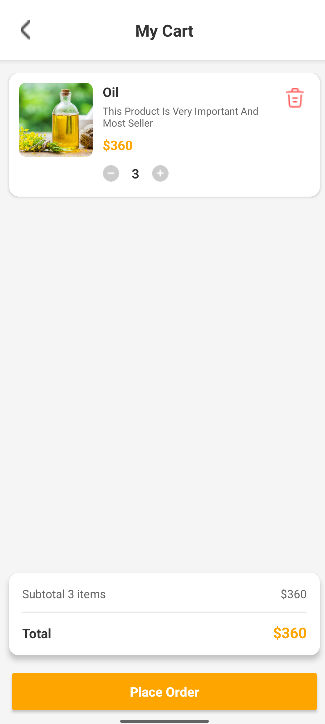

# 🛒 Shopping App 

This project showcases a complete user interface flow for an e-commerce application, built using native Android views (XML) and focusing on a clean, modern design with an orange/white color scheme.

The screens cover the core journey: **Product Detail** → **Empty Cart** → **Cart with Items** → **Payment Success**.

## ✨ App Screens and User Flow

The following screenshots illustrate the main screens developed in this project, demonstrating a smooth and intuitive shopping experience.

---

### 1. Product Detail Screen

This is the entry point where users view product information, pricing, and key features.

* **Key Features:** Dedicated search bar, promotional badges ("Official Store," "Free Delivery"), price comparison, and a prominent "Add To Cart" action.

---

### 2. Empty Cart State

This screen provides a clear call-to-action when the cart is empty, encouraging the user to return to shopping.

* **Key Features:** Clear status message, large icon, and an orange "start shopping" button.

---

### 3. My Cart (Checkout) Screen

This screen allows the user to review items, adjust quantities, and see the final total before placing the order.

* **Key Features:** Quantity adjustments (+/- buttons), item removal icon (trash can), subtotal, and the final "Place Order" button.

---

### 4. Payment Successful Confirmation

The final screen provides visual confirmation that the transaction has been completed successfully.

* **Key Features:** Clear "Payment Successful!" message and a compelling illustration.

#
